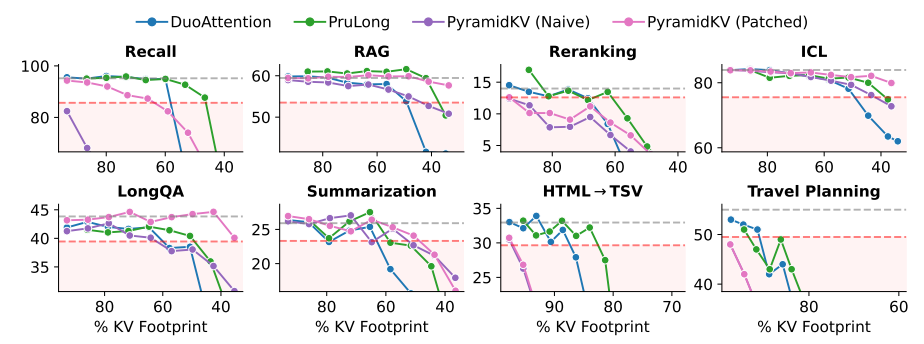

# PruLong

[[Paper]](https://www.arxiv.org/abs/2506.17121)

<div align="center">
  
  <p><em>PruLong, an end-to-end training method that learns local and global attention heads. We also adapt PyramidKV to reduce its KV footprint.</em></p>
</div>

This is the homepage for the code release for the preprint "Cache Me If You Can: How Many KVs Do You Need for Effective Long-Context LMs?"

This repository contains code for
- The modeling and training code for **PruLong** (**Pru**ned **Long**-Context model), a method that learns 0/1 mask parameters to designate attention heads as local or global. PruLong enables efficient inference with reduced KV cache usage, which we measure in our paper in terms of teh *KV footprint*.
- Code that evaluates PruLong, along with baselines and our improvements upon them: [DuoAttention](https://arxiv.org/abs/2410.10819), [PyramidKV](http://arxiv.org/abs/2406.02069), [SnapKV](https://arxiv.org/abs/2406.02069), and [Locret](https://arxiv.org/abs/2406.02069).

Please refer to our paper (linked above) for more details.

**Authors**: Adithya Bhaskar\*, Alexander Wettig\*, Tianyu Gao, Yihe Dong, and Danqi Chen

## Release Progress

- [x] PruLong training code
- [x] Evaluation code for PruLong and baselines
- [ ] Trained model checkpoints

## Setup and usage

We provide separate README files with instructions for setup and usage inside the `prulong/` and `eval/` directories. You can also find more information on how to prepare the data for training in the [ProLong](https://github.com/princeton-nlp/ProLong) repository. Each of these directories has its own `requirements.txt` file, so please install the dependencies for each of them separately.

Here is the high-level overview of the codebase:

- `prulong/`: Contains the code for training PruLong. In particular, files under `prulong/training/` implement the modified Llama class, the training loop, and data-loading utilities. The `prulong/save_prulong_masks.py` script is to be run after training to save the trained masked values from the model checkpoint (as described in the README inside `prulong/`). Scripts for launching training runs are provided in `prulong/run_scripts/`. For now, we only supprt Llama models.
- `eval/`: Contains the code for evaluating PruLong and baselines. This directory is structured after [HELMET](https://github.com/princeton-nlp/HELMET). Please refer to the several run scripts provided inside `eval/run_scripts/` to see examples of how to run the evaluation. We also provide the utility `eval/viz/plot_kv_footprint.py` for visualizing the KV footprint of the different methods.
- `MInference/`: To evaluate PyramidKV, SnapKV, and Locret, we use the MInference library. Though the steps to install are the same as in the [original](https://github.com/microsoft/MInference) repository, we provide our modified codebase which implements these methods, as well as improvements described in our paper. You will need to install this in order to evaluate these three with the `eval/` code.    

## Contact

Please email Adithya (`adithyab@princeton.edu`) if you have any questions.
You can also open a GitHub issue if you encounter any bugs or problems.

## Citation

If you use this code in your research, please cite our paper:

```bibtex
@misc{bhaskar2025cache,
    title={Cache Me If You Can: How Many {KV}s Do You Need for Effective Long-Context {LM}s?}, 
    author={Adithya Bhaskar and Alexander Wettig and Tianyu Gao and Yihe Dong and Danqi Chen},
    journal={arXiv preprint arXiv:2506.17121},
    year={2025}
}
```